<h1>Anime List</h1>
<h3>About this project</h3>

<h4>This list was created so that you can write down the anime you want to watch</h4>

1. Go to http://localhost:7030
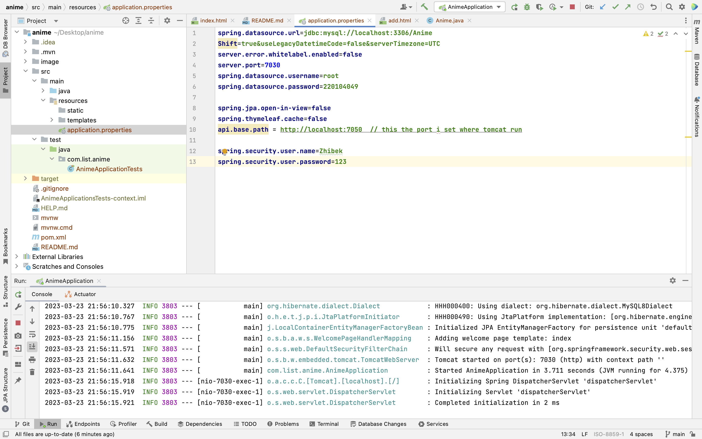

1. Then you will se login page (that I created by using Spring Security)
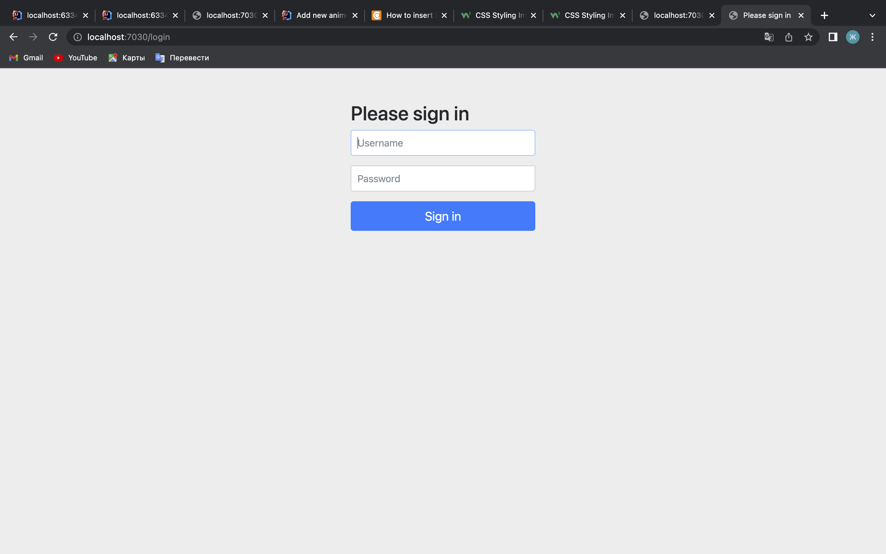
password you can see in application.properties
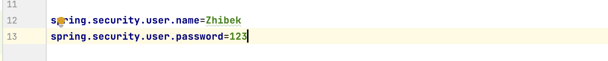
1. Then when you will log in you will see the main page.
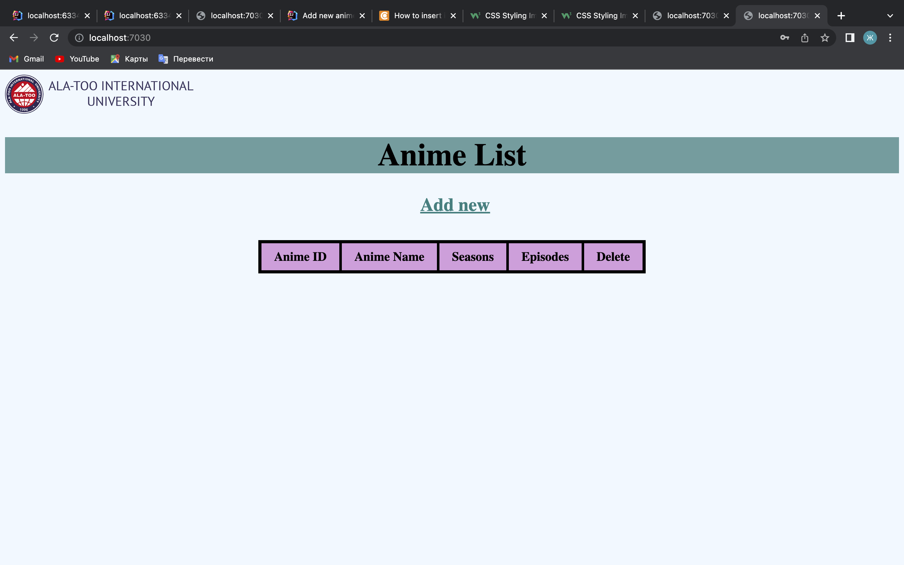
You can see the logo, tittle and table.
1. To see something on this page you need to click on "Add new"
2. 
3. After you will see second page(add.html)
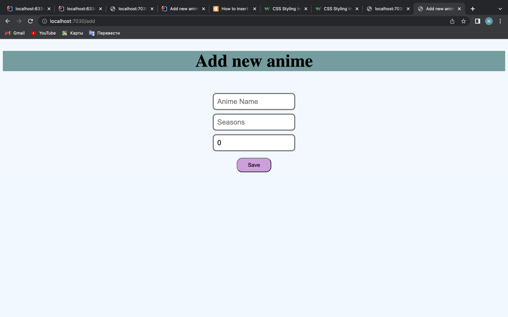
Here you need to write 
   * Anime name (string)
   * How many seasons anime have (string)
   * Episodes (int)
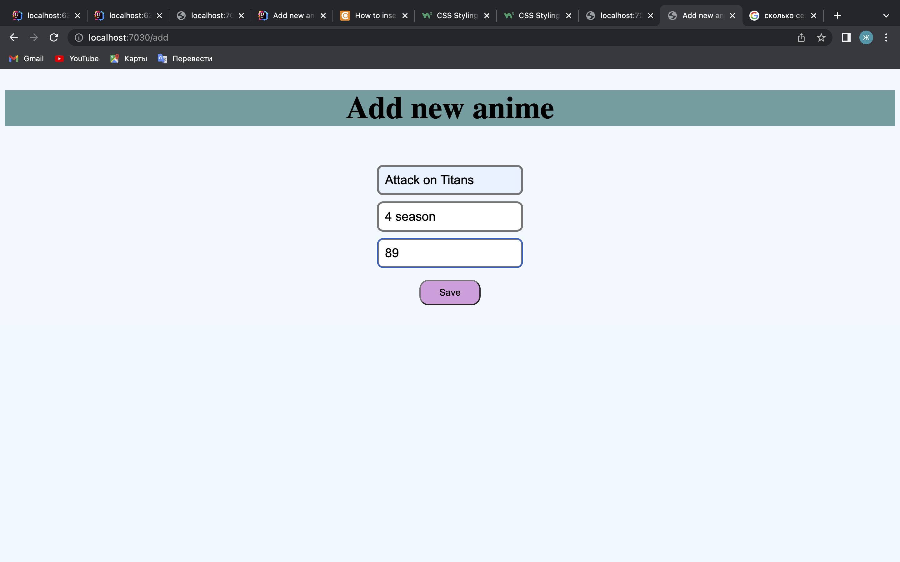
Result
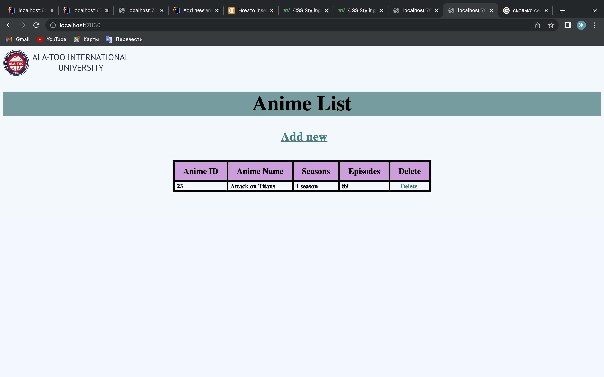
It will be saved in DB(I use MySQL)
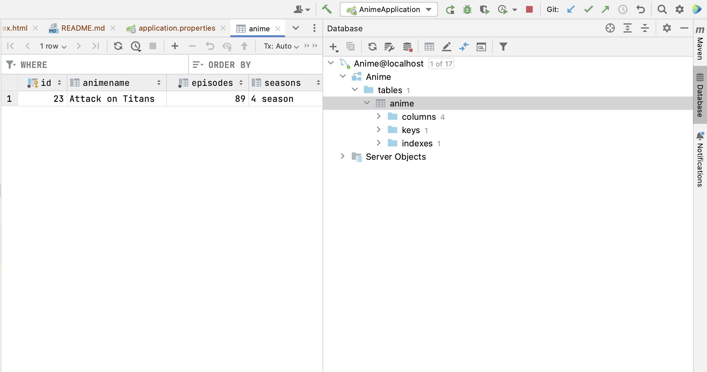
connection you can see in application.properties
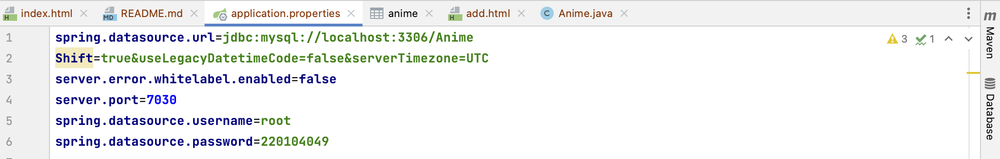

7. Also you can delete Anine that you finished watching  
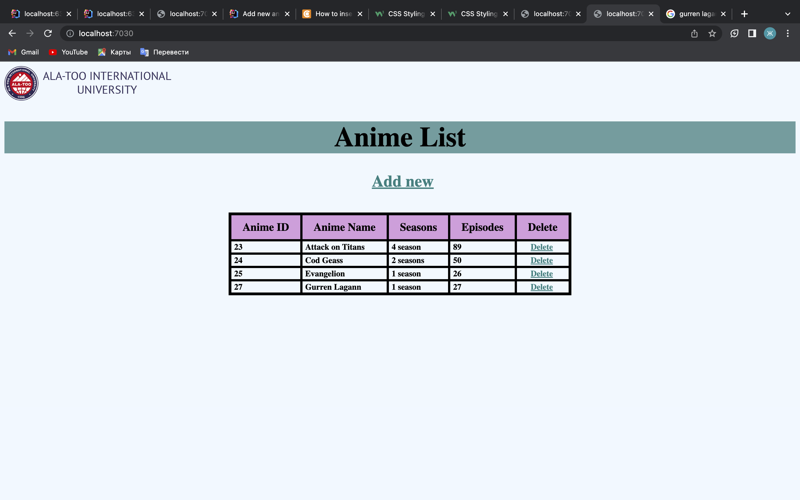
in DB
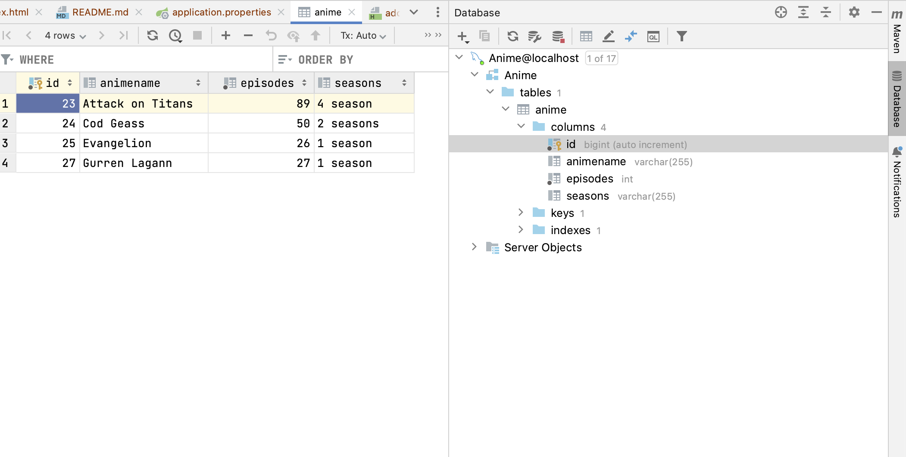
before
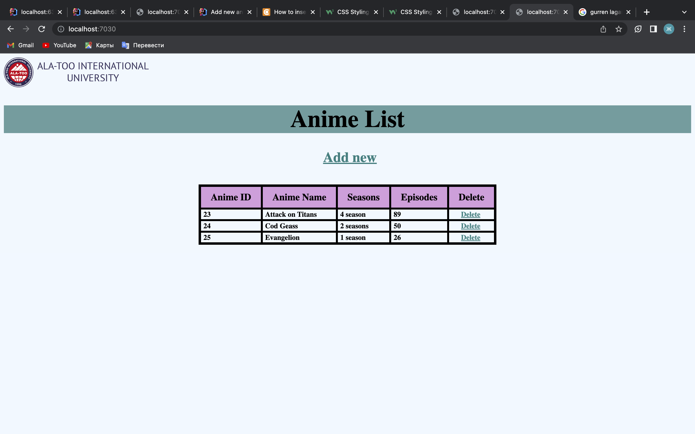
after
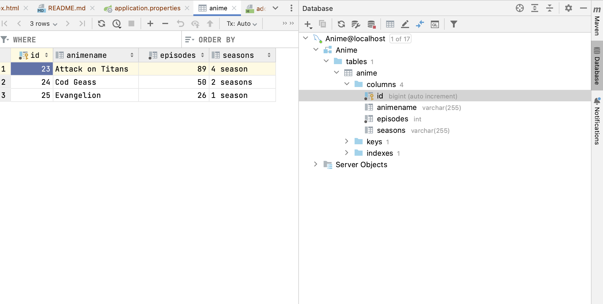

8. So that all, use it properly

I started this project early but my past projects broke or didn't work

